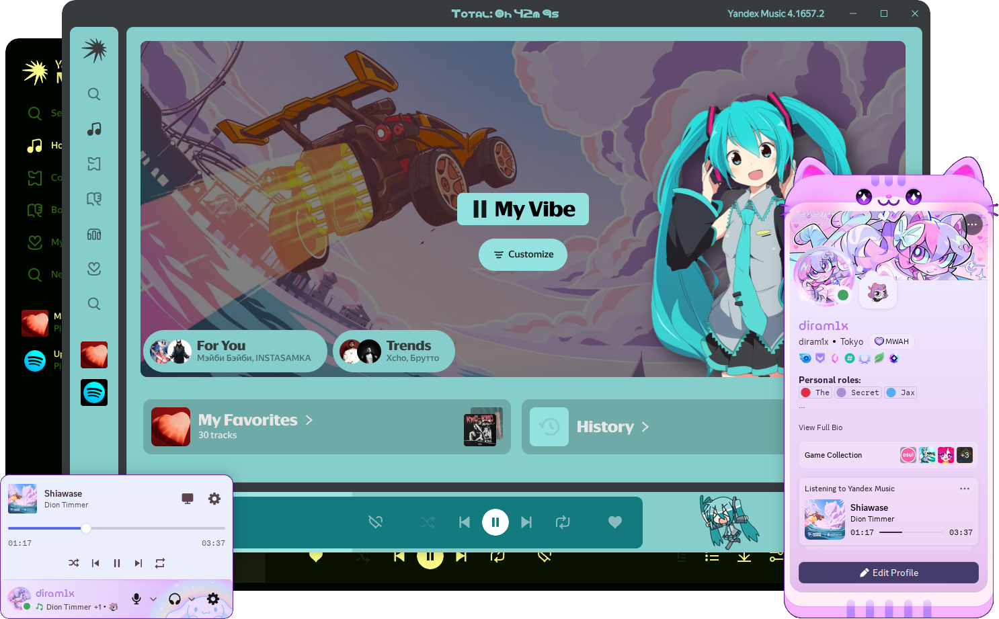

# Next Music

Web client for Yandex Music with support for themes, addons and Discord Rich Presence (RPC)

## Features

<details>
  <summary>Themes & addons</summary>

  > <blockquote><strong>Important:</strong> Some features are adapted from <a href="https://github.com/PulseSync-LLC/PulseSync-client">PulseSync Client</a> to provide compatibility with themes and addons originally developed for <a href="https://pulsesync.dev/">PulseSync</a>.
  
  
</details>

<details>
  <summary>Discord Rich Presence</summary>

  
</details>

<details>
  <summary>Volume normalization (Experimental)</summary>
  <blockquote><strong>Important:</strong> This mod has been adapted from <a href="https://github.com/PulseSync-LLC/PulseSync-mod/">PulseSync Mod.</blockquote>
</details>

<details>
  <summary>OBS widget</summary>
  
  > It can be enabled in the settings. It opens at `localhost:4091`
  
  

https://github.com/user-attachments/assets/7c25dd85-3f55-43a6-bd19-6e9a2dd1491a

</details>

<details>
  <summary>Listen Along (Experimental)</summary>
  
  > It can be enabled in the settings.

  

  
</details>

<details>
  <summary>UGC Share</summary>

> Allows sharing and downloading tracks that the user has uploaded to Yandex Music.

https://github.com/user-attachments/assets/73bf3536-d59c-4be5-a53c-0ff38f3844d1

</details>

<details>
  <summary>Downloader</summary>

> Allows downloading tracks directly from Yandex Music.

</details>

<details>
  <summary>Wide Player Panel</summary>
  <blockquote><strong>Important:</strong> This mod has been adapted from <a href="https://github.com/PulseSync-LLC/PulseSync-mod/">PulseSync Mod</a> (formerly <a href="...">YandexMusicModClient</a>).</blockquote>

> Expands the Yandex Music player panel.

</details>

<details>
  <summary>Disable Auto Zoom</summary>

> Disables automatic scaling of the Yandex Music interface.

</details>

<details>
  <summary>Fast Play</summary>

> Plays a track when pressing Ctrl + V with a saved link or a direct ID.

</details>

<details>
  <summary>Dev Panel</summary>

> Enables the Yandex Music Dev Panel.


</details>

<details>
  <summary>Lite Mode Control</summary>

> Always shows the Lite Mode toggle slider in the settings.


</details>

<details>
  <summary>Yandex Experiments Override</summary>

> Allows overriding Yandex Music experiments and enabling unavailable features.

  
</details>

## Installation

### Windows

Download the latest installer from the [releases page](https://github.com/Web-Next-Music/Next-Music-Client/releases/latest).

### Arch Linux

Install via AUR using your preferred AUR helper:

```bash
paru -S next-music
```

### Other Linux

Download the package from the [releases page](https://github.com/Web-Next-Music/Next-Music-Client/releases/latest).

## To change the program settings, open the program settings in tray lol.


## Recomended Scripts

### [Yandex Music Downloader](https://greasyfork.org/en/scripts/558745-yandex-music-downloader)

https://github.com/user-attachments/assets/cd3a627f-784b-4874-a1c2-cd3611f07d54

## Credits
- **[PulseSync Mod](https://github.com/PulseSync-LLC/PulseSync-mod/)**
- **[PulseSync Client](https://github.com/PulseSync-LLC/PulseSync-client/)**

# Discord Server - Click on the image below

[](https://discord.gg/ky6bcdy7KA)
